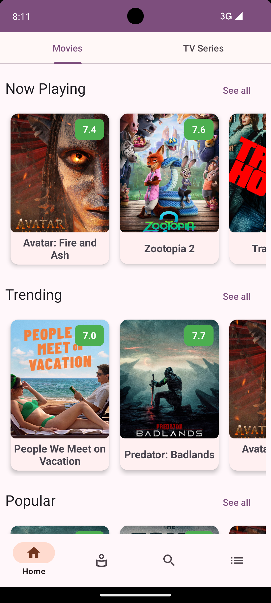
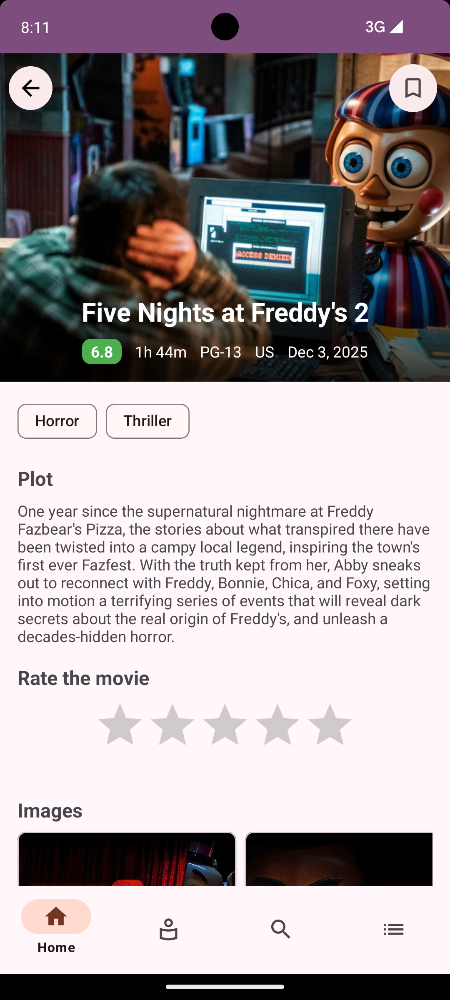
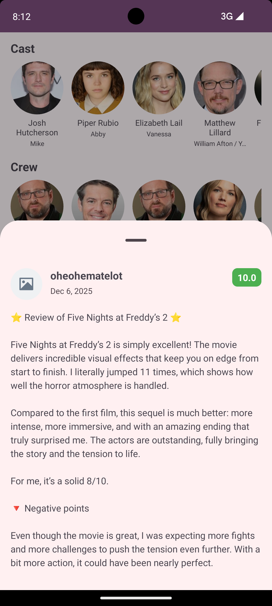
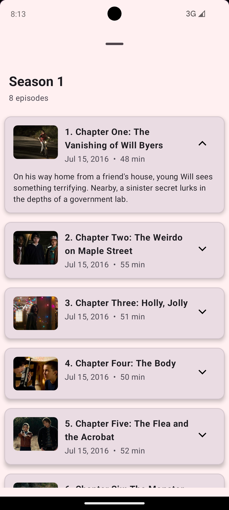
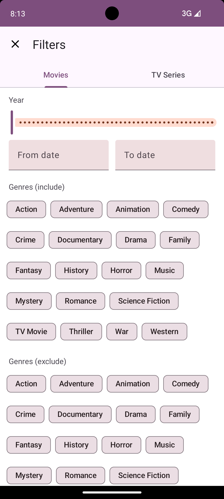
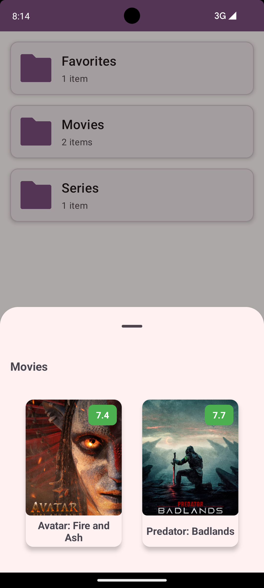
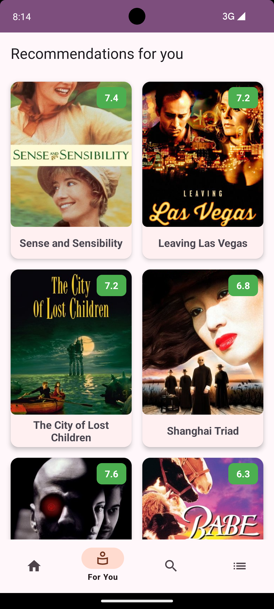
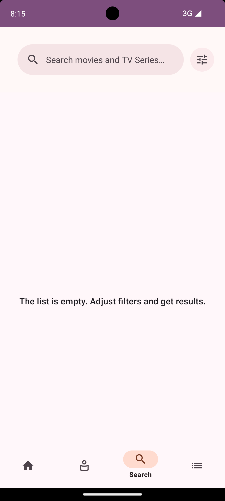

# CineCircle

An Android app for browsing movies and TV shows with AI-powered recommendations.

## Overview

CineCircle is a multi-module Android application that lets users discover, browse, and get personalized movie and TV show recommendations. Built with modern Android architecture and clean code principles.

This app uses **The Movie Database (TMDB) API** to fetch movie and TV show data.


## Download
[](https://play.google.com/store/apps/details?id=com.koniukhov.cinecirclex)

[](https://play.google.com/store/apps/details?id=com.koniukhov.cinecirclex)


## Features

- 🎬 Browse movies and TV shows
- 📝 View detailed information (cast, crew, ratings, reviews)
- ⭐ Rate movies and TV shows
- 🤖 AI-powered recommendations based on your ratings
- 💾 Local database for offline access
- 🔍 Search functionality

## Screenshots

<div>
  
  
  
  
  
  
  
  
</div>

## Tech Stack

- **Language:** Kotlin
- **Architecture:** Multi-module, MVVM
- **DI:** Hilt
- **Database:** Room
- **Async:** Coroutines + Flow
- **Navigation:** Jetpack Navigation Component
- **UI:** Material Design 3
- **Build:** Gradle (Kotlin DSL), KSP
- **ML:** NumPy embeddings

## Project Structure

```
├── app/                        # Main application module
├── core/
│   ├── common/                 # Common utilities
│   ├── data/                   # Data layer
│   ├── database/               # Room database
│   ├── design/                 # Design system
│   ├── domain/                 # Domain models
│   ├── network/                # Network layer
│   └── ui/                     # Shared UI components
└── feature/
    ├── ai_recommendations/     # AI recommendations feature
    ├── collections/            # Collections feature
    ├── home/                   # Home screen
    ├── media_details/          # Movie/TV show details
    └── search/                 # Search feature
```

## Getting Started

### Prerequisites

- Android Studio (latest stable version)
- JDK 17
- Android SDK (API 24+)

### Build & Run

1. Clone the repository
   ```bash
   git clone https://github.com/riggelllll/CineCircle.git
   ```

2. Open the project in Android Studio

3. Get your TMDB API Key:
   - Go to [The Movie Database (TMDB)](https://www.themoviedb.org/)
   - Create a free account
   - Navigate to Settings → API
   - Request an API key (choose "Developer" option)
   - Copy your API key

4. Create a `secrets.properties` file in the project root directory and add your API key:
   ```properties
   API_KEY=your_api_key_here
   ```
   Note: This file is not tracked by git (.gitignore) to keep your API key secure.

5. This project includes Firebase Crashlytics, but google-services.json is intentionally ignored in this repository to avoid leaking sensitive configuration. To enable Crashlytics locally, place your own google-services.json file in the project. If you prefer not to use Crashlytics, remove the Crashlytics-related plugin/dependency lines and any initialization code from your Gradle files and rebuild.

6. Build and run
   ```bash
   ./gradlew assembleDebug
   ```

## Architecture

This project follows Android's recommended architecture with clean architecture principles:

- **Presentation Layer:** Fragments, ViewModels, UI State
- **Domain Layer:** Use cases, business logic
- **Data Layer:** Repositories, data sources (local + remote)

Each feature is isolated in its own module for better scalability and maintainability.

## AI Recommendations

The recommendation system uses:
- User rating history stored in local database
- Pre-computed movie embeddings
- Cosine similarity for finding similar items
- On-device inference for privacy

## License

This project is available under the MIT License.
